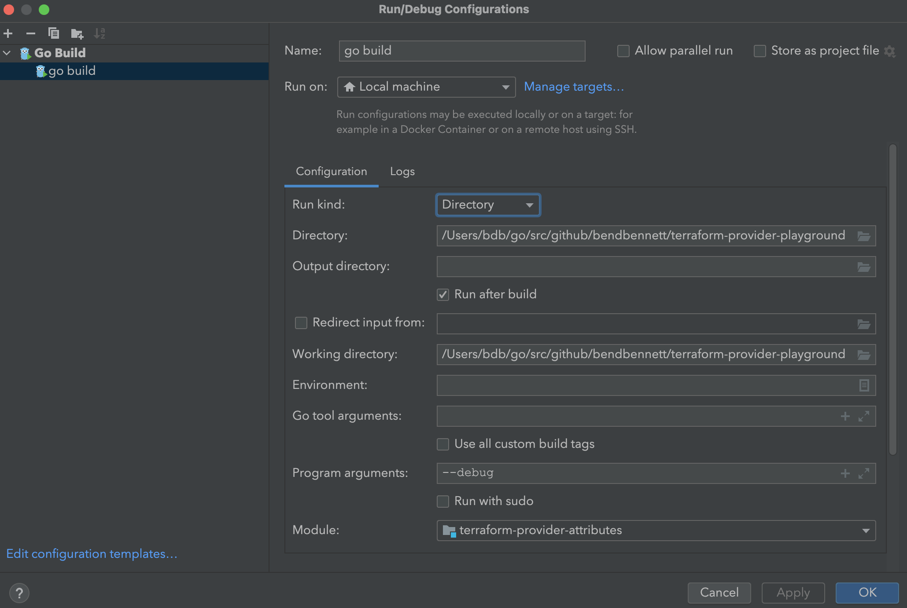

# Terraform Provider Playground

This provider is based on the [Terraform Provider Scaffolding](https://github.com/hashicorp/terraform-provider-scaffolding-framework) repo which is built on the [Terraform Plugin Framework](https://github.com/hashicorp/terraform-plugin-framework).

The intention is for this repo to be used for testing and/or illustrating ideas relating to the creation and usage of Terraform providers.

## Requirements

- [Terraform](https://www.terraform.io/downloads.html) >= 1.0
- [Go](https://golang.org/doc/install) >= 1.18

## Building

- Clone this repository 
- Enter the repository directory 
- Build the provider using the `make install` command:

```shell
make install
```

## Running 

### Using CLI Configuration

Terraform can be configured to use a local version of the provider binary by using [development overrides](https://www.terraform.io/cli/config/config-file#development-overrides-for-provider-developers).

For instance, a `.terraformrc` file placed in the home directory and containing the following would result in Terraform using the local binary for this provider.

```
provider_installation {

  dev_overrides {
      "bendbennett/playground" = "</path/to/your>/go/bin"
  }

  # For all other providers, install them directly from their origin provider
  # registries as normal. If you omit this, Terraform will _only_ use
  # the dev_overrides block, and so no other providers will be available.
  direct {}
}
```

[Locations](https://www.terraform.io/cli/config/config-file#locations) describes the appropriate directory for placing CLI configuration for different operating systems.

Once the CLI configuration is in place, Terraform can be run using the local provider binary by first building and installing the binary and then using the examples.

```shell
make install
cd examples
terraform apply
```

### Debug Mode

The Provider can be run in debug mode.

The following illustrates a typical debug configuration using GoLand:



Once the debug configuration has been setup, run the binary in debug mode:


This should generate something like the following in the console:

```shell
TF_REATTACH_PROVIDERS='{"registry.terraform.io/bendbennett/playground":{"Protocol":"grpc","ProtocolVersion":6,"Pid":10915,"Test":true,"Addr":{"Network":"unix","String":"/var/folders/23/p8tx31c53rd16t1pjt03zndc0000gq/T/plugin685580913"}}}'
```

Open a terminal and set the environment variable for `TF_REATTACH_PROVIDERS` by running:

```shell
export TF_REATTACH_PROVIDERS='{"registry.terraform.io/bendbennett/playground":{"P.........
```

Set breakpoints in the provider code and then run the terraform commands (e.g., `terraform apply`).

## Testing

### Unit Tests

```shell
make test
```

### Acceptance Tests

```shell
make testacc
```
